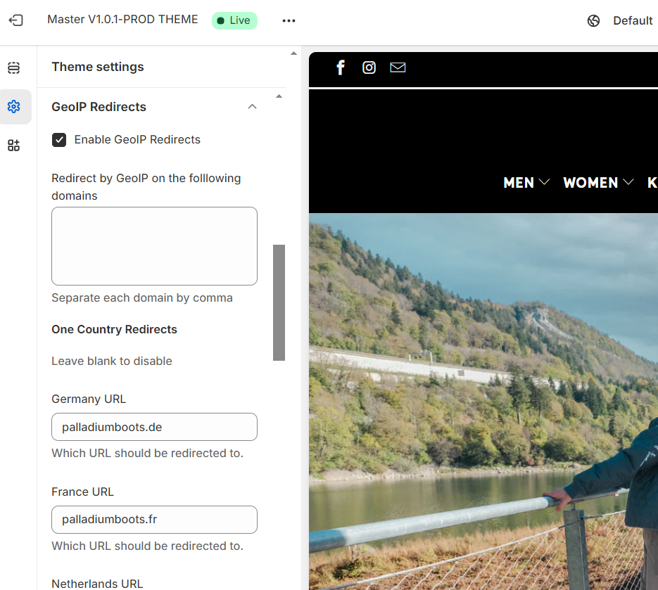

# CodeSample_Shopify

1. GeoIP redirection
The setup is to get the user location based IP and redirecting the use automatically to the specific store fortheir region. 
File config/settings_schema.json is to configure the country name, URL and enable/disable auto-redirect.
 
 